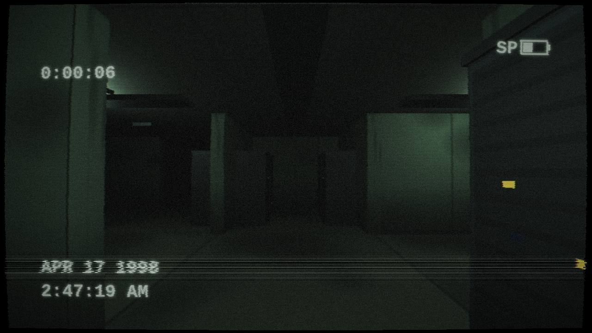
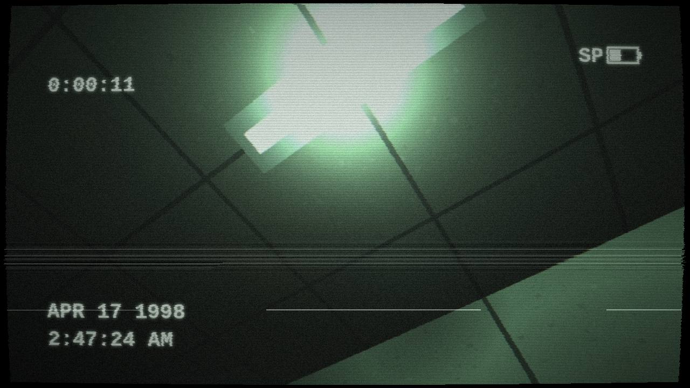
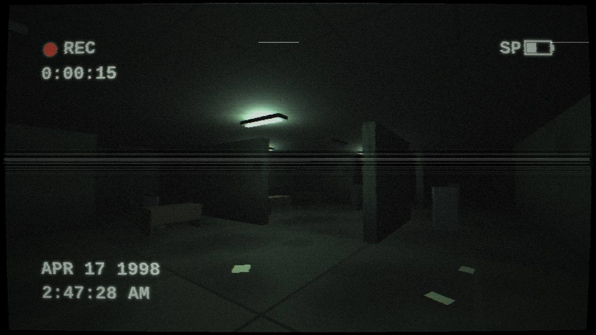
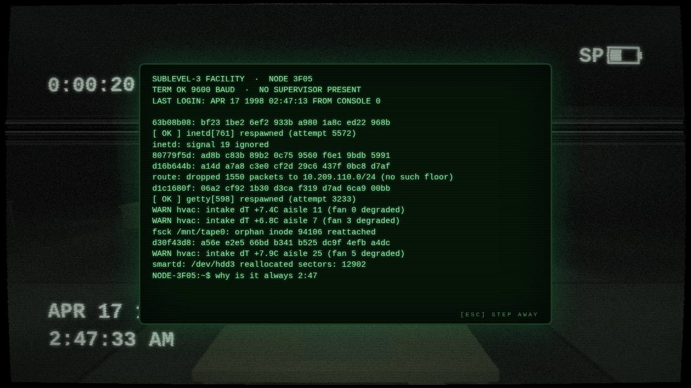

# SUBLEVEL 3

A first-person exploration game set in an **infinite, procedurally generated
data-center labyrinth**, viewed entirely through a failing VHS camcorder.
There are no objectives, no combat, and no exits. Only aisles.


| | | |
| --- | --- | --- |
|  |  |  |



## Play

**In a browser:** the game auto-deploys to GitHub Pages on every push —
<https://darth-ginger.github.io/da-game/> (one-time setup: repo *Settings →
Pages → Source: “GitHub Actions”*). Works on desktop and phones.

**Locally:**

```bash
npm install
npm run dev      # open the printed URL
npm run build    # static build in dist/
```

Headphones strongly recommended.

| Desktop | Action |
| --- | --- |
| Click | Insert tape / resume |
| `W A S D` / arrows | Move |
| Mouse | Look |
| `Shift` | Run |
| `F` | Toggle camcorder light |
| `E` | Inspect a workstation terminal |
| `Esc` | Pause / step away from a terminal |

| Touch (phone / tablet) | Action |
| --- | --- |
| Tap | Insert tape |
| Left thumb | Analog joystick — move (appears where you touch) |
| Push stick to the rim | Run |
| Right thumb drag | Look |
| `☼ LIGHT` button | Toggle camcorder light |
| `INSPECT TERMINAL` button | Use a workstation (tap the screen to type) |

## How it works

- **Infinite maze** — the world is a pure function of integer cell
  coordinates and a seed (`src/maze.js`). A binary-tree carve guarantees every
  cell is reachable; braiding adds loops, hash-stamped rooms and large-scale
  zones (server farms, abandoned offices, dark sectors, open halls) give the
  labyrinth texture. Nothing is stored: any region can be generated locally,
  forever, in any direction.
- **Chunk streaming** — `src/world.js` bakes 8×8-cell chunks into instanced
  meshes (walls, racks, LEDs, fluorescents, furniture, cable trays) and
  streams them around the player. Fog hides the horizon. Server zones lay
  dense rack aisles; every other zone gets intermittent stray cabinets,
  still powered, blinking at nobody.
- **Workstation terminals** — abandoned desks with glowing CRTs scattered
  through the facility (`src/terminal.js`). Walk up and press `E` (or tap)
  to lean into a phosphor-green console with a blinking cursor. It echoes
  anything you type, clears the line on Enter, runs nothing, and — left
  alone — occasionally scrolls bursts of maintenance-log nonsense that is
  almost, but not quite, plausible.
- **The haunt** — the nearest CRTs are live world objects (`src/screens.js`):
  on an irregular clock they type to themselves (hesitant lowercase
  questions, sometimes erased again) or scroll log bursts you catch in your
  peripheral vision, with key clicks localized at that desk. Some of these
  events reach the building (`src/haunt.js`): server fans spin up and LEDs
  chatter faster, a fluorescent snaps on, dies, or strobes, the air
  conditioning cuts out or roars on. Between them, sparse presence events —
  keyboard chatter one row over, footsteps behind you that approach and
  stop, a chair creaking under someone's weight, a rack door clanking in
  the dark. You are alone. For now.
- **VHS camcorder** — the scene renders into a 480-line target, then a single
  post pass (`src/vhs.js`) adds barrel distortion, chroma bleed, line jitter,
  tracking bands, head-switching noise, scanlines, grain, dropouts and a
  lifted, desaturated grade. The OSD (blinking REC, tape counter, 1998
  timestamp, dying battery) is composited *before* the tape damage, so it
  degrades like a real recording.
- **Procedural audio** — `src/audio.js` synthesizes everything with the Web
  Audio API: ventilation rumble, 60 Hz mains hum, camcorder hiss, and a pool
  of HRTF-panned emitters for server fans, coil whine, hard-drive click
  bursts and fluorescent ballast buzz (tied to each fixture's live flicker
  state). Sounds swell as you approach their sources. No audio files ship
  with the game.
- **Lighting** — instanced emissive LEDs (green/red/blue/amber, blinking in
  shader) and fluorescent tubes with a random-telegraph flicker model. A
  small pool of real point lights is continuously re-assigned to the nearest
  live fixtures.

## Stack

[Three.js](https://threejs.org/) + [Vite](https://vitejs.dev/). No other
runtime dependencies, no binary assets — every texture is painted onto a
canvas and every sound is synthesized at startup.
